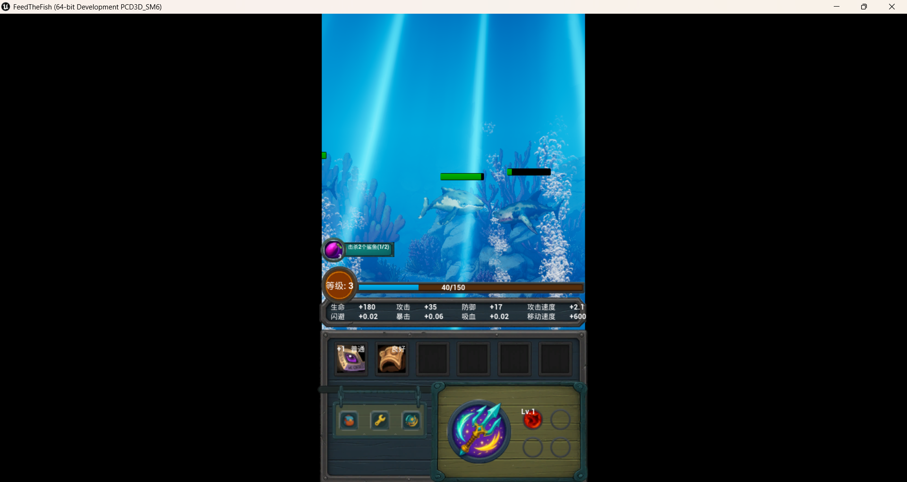
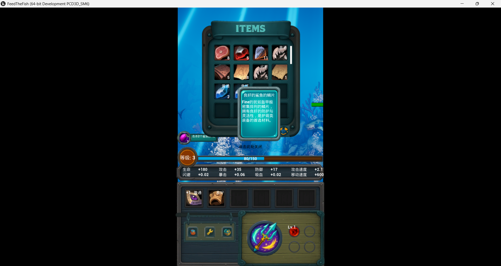
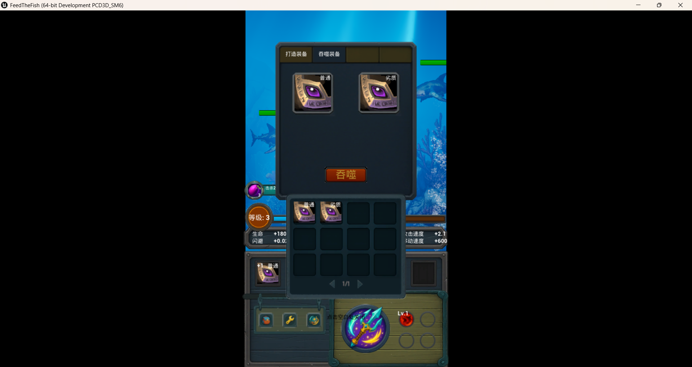
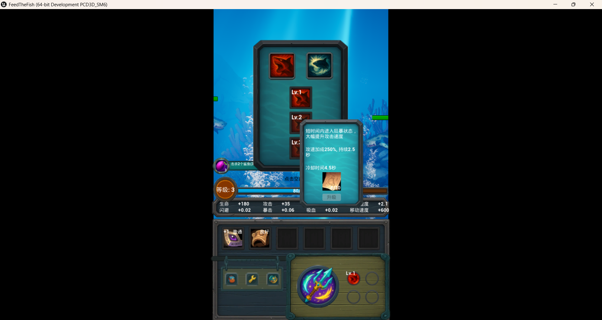
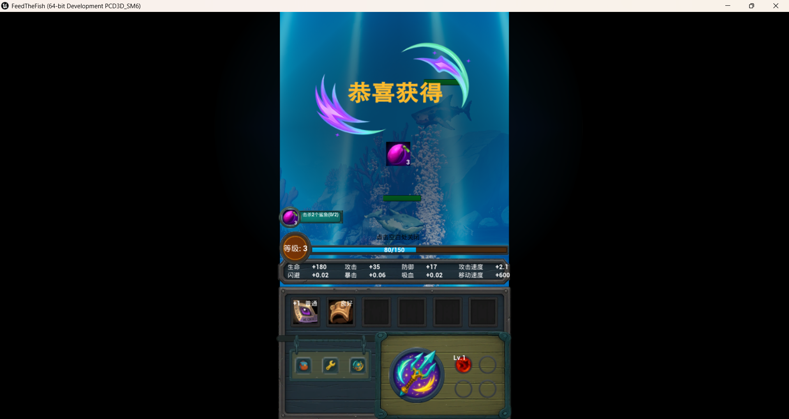

# FeedTheFish-GameplaySystems
Mobile RPG prototype built with Unreal Engine 5 and C++, focused on gameplay systems and progression mechanics.

This project focuses on interconnected gameplay systems including combat, progression, inventory, equipment, crafting, skill tree, quest systems, tutorial flow, and mobile interaction.

---

## Gameplay Demo

🎥 Watch Demo Video:

[Gameplay Systems Demo](PUT_VIDEO_LINK_HERE)

---

## Screenshots

### Combat System

[Put Combat Screenshot Here]



---

### Inventory & Equipment

[Put Inventory Screenshot Here]



---

### Equipment Enhancement

[Put Enhancement Screenshot Here]



---

### Skill Tree System

[Put Skill Tree Screenshot Here]



---

### Quest & Tutorial System

[Put Quest/Tutorial Screenshot Here]



---

## Overview

Feed The Fish is a mobile RPG prototype centered around a complete gameplay progression loop:

Combat → Rewards → Progression → Stronger Challenges

The goal of this project was to create connected gameplay systems rather than isolated mechanics.

Players can:

- Fight enemies
- Collect loot
- Manage inventory
- Equip and enhance gear
- Learn skills
- Complete quests
- Progress through guided tutorials

---

## My Responsibilities

Responsible for gameplay programming and gameplay system implementation:

- Combat System
- Character Attribute System
- Loot System
- Inventory System
- Equipment System
- Equipment Enhancement
- Crafting System
- Skill Tree System
- Quest System
- Tutorial System
- Mobile Input
- UI Logic

Art assets and visual resources were created separately.

---

## Core Features

### Combat System

- Auto attack behavior
- Damage calculation
- Critical hit logic
- Attack speed handling
- Combat interactions

---

### Character Attribute System

- HP
- Attack
- Defense
- Critical chance
- Attack speed
- Runtime stat updates
- Equipment bonus calculations

---

### Loot System

- Enemy resource drops
- Randomized loot generation
- Item pickup interactions

---

### Inventory System

- Runtime item management
- Equipment storage
- Material storage
- Dynamic item information display

---

### Equipment System

- Equipment equipping
- Character stat updates
- Equipment progression support

---

### Equipment Enhancement System

- Equipment strengthening
- Progression-based upgrades
- Runtime stat scaling

---

### Crafting System

- Recipe-based crafting
- Resource consumption
- Equipment generation

---

### Skill Tree System

- Skill learning
- Skill progression
- Upgrade mechanics

---

### Quest System

- Objective tracking
- Quest progression
- Reward system

---

### Tutorial System

- Guided onboarding
- Interactive prompts
- Tutorial progression flow

---

### Mobile Interaction

- Tap movement
- Target selection
- UI interaction flow

---

## Tech Stack

- Unreal Engine 5
- C++
- UMG
- Blueprint + C++ integration

---

## Project Structure

```text
Source/

├── Combat/
│ ├── CombatSystem.cpp
│ ├── PlayerCombatComponent.cpp
│ └── EnemyCombatComponent.cpp

├── Character/
│ ├── PlayerCharacter.cpp
│ └── CharacterAttributeComponent.cpp

├── Enemy/
│ ├── EnemyActor.cpp
│ ├── SharkBehavior.cpp
│ └── EliteSharkBehavior.cpp

├── Inventory/
│ ├── InventoryManager.cpp
│ ├── DropSystem.cpp
│ └── DropActor.cpp

├── Equipment/
│ ├── EquipmentManager.cpp
│ └── CraftingSystem.cpp

├── Skill/
│ └── SkillManager.cpp

├── Input/
│ ├── PlayerGameController.cpp
│ └── FingerClickActor.cpp

└── Camera/
└── FollowCameraActor.cpp
